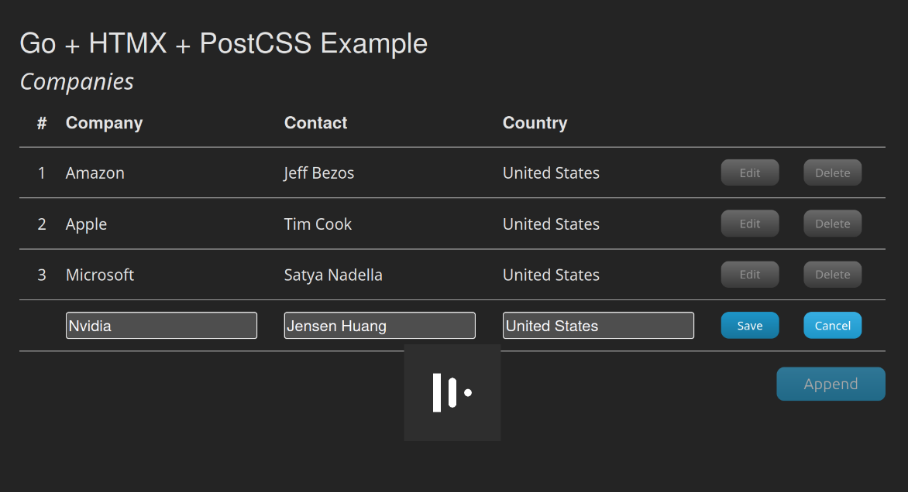

# go-htmx-post-css-example

## Example CRUD Web application written in Go, HTMX, PostCSS

This is example Web application which is using [HTMX](https://htmx.org/) Javascript frontend library and 
framework-less CSS generated with [PostCSS](https://postcss.org/). Server side rendering done with [Go HTML 
templates](https://pkg.go.dev/html/template) on backend. 

Application builds single executable with all frontend code and templates embedded into it.

## Change History

* Ver. 0.1 - initial implementation 
* Ver. 0.2 - set of refactorings. Reduced payload and handling for some of the HTML actions. Also added dynamic UI button blocking in edit mode. 

## Highlights

### Frontend dependencies

* [HTMX](https://htmx.org/) is a JavaScript library that streamlines web development by enabling you to define page behavior using HTML attributes and server-side logic, reducing the reliance on client-side JavaScript.
* [Vite](https://vite.dev) is a frontend tooling framework.
* [PostCSS](https://postcss.org/) plug-ins toolchain for consistent CSS styling and reducing assets size.

### Server side Go dependencies
* [Go HTML templates](https://pkg.go.dev/html/template) for server side rendering
* [Chi](https://github.com/go-chi/chi) HTTP server 
* [Zerolog](https://github.com/rs/zerolog) for logging

Code in this project partially based on this [repo](https://github.com/jritsema/go-htmx-tailwind-example). 
Thanks a lot to an author ❤️ it was solid starting point for my HTMX Go trip! All CRUD models and Go HTML templates were 
shamelessly taken from there. 

## Screenshot



## Build instructions

```console
cd web/frontend
npm i
npm run build
```

This should build your frontend assets into <code>web/frontend/dist</code> directory. 

```console
cd ../..
go build .
```
This should build Go executable and embed assets and templates into it.

```console
./htmx-example
```

By default application runs on http://localhost:8080

```console
./htmx-example --Host 0.0.0.0 --Port 8081 --SimulatedDelay 1000
```

Optionally you can specify different host, port and simulate server side processing delay in milliseconds.

